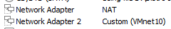

+++
template = "blog-page.html"
title = "Using kea DHCP server for netbooting"
description = "Booting from netboot.xyz with Kea"
date = "2024-07-17"
authors = ["Nguyen Thai"]
[taxonomies]
tags = ["network"]
[extra]
toc = true
+++
Recently, I've been playing around with PXE booting using [iPXE](https://ipxe.org) and various DHCP servers: `dnsmasq`, `isc-dhcp`, `pfsense`, `opnsense` (yes the last 2 are not only DHCP servers).

Since `isc-dhcp` [has reached EOL](https://www.isc.org/blogs/isc-dhcp-eol/), ISC recommended switching to [`Kea` dhcp server](https://www.isc.org/kea/). So that's what we're going to setup today.


## Prerequisites

I'm using 2 VMs for this: 1 VM running Ubuntu Server 24.04, and 1 blank VM for netbooting. 

The Ubuntu 24.04 VM has 2 network interface, connect to 2 different networks. Make sure 1 of those network has Internet access. Here's what it looks like in VMWare:



The setup looks like this:


Installed softwares on the Ubuntu 24.04 server:
- `kea`
- `postgresql` (for storing hosts and leases)
- `tftpd-hpa`

Install them with this command:

```bash
$ sudo apt install kea postgresql tftpd-hpa -y
```

For other OSes and platforms, check out [Kea installation docs](https://kea.readthedocs.io/en/kea-2.6.0/arm/install.html).

If the installer asks to setup control agent, just say no. We won't go into using control agent to configure kea here, but you can [check the docs on how to use the agent](https://kea.readthedocs.io/en/kea-2.6.0/arm/agent.html).

## Setup networking

In my Ubuntu VM, the network adapter connected to NAT is named `ens33`, and the other adapter is named `ens37`.

We're going to use `netplan` to configure the `ens37` network. Use your distro tool if you're using other OSes.

Open `/etc/netplan/20-netboot.yaml` and paste this in:

```yaml
network:
    ethernets:
        ens37:
            addresses:
                - 10.10.10.1/24 # You can use any network here
    version: 2
```

Then apply the configuration and check the result:

```bash
$ sudo netplan apply
$ ip address show
1: lo: <LOOPBACK,UP,LOWER_UP> mtu 65536 qdisc noqueue state UNKNOWN group default qlen 1000
    link/loopback 00:00:00:00:00:00 brd 00:00:00:00:00:00
    inet 127.0.0.1/8 scope host lo
       valid_lft forever preferred_lft forever
    inet6 ::1/128 scope host noprefixroute
       valid_lft forever preferred_lft forever
2: ens33: <BROADCAST,MULTICAST,UP,LOWER_UP> mtu 1500 qdisc pfifo_fast state UP group default qlen 1000
    link/ether 00:0c:29:5b:95:0b brd ff:ff:ff:ff:ff:ff
    altname enp2s1
    inet 172.20.20.109/24 metric 100 brd 172.20.20.255 scope global dynamic ens33
       valid_lft 1703sec preferred_lft 1703sec
    inet6 fe80::20c:29ff:fe5b:950b/64 scope link
       valid_lft forever preferred_lft forever
3: ens37: <BROADCAST,MULTICAST,UP,LOWER_UP> mtu 1500 qdisc pfifo_fast state UP group default qlen 1000
    link/ether 00:0c:29:5b:95:15 brd ff:ff:ff:ff:ff:ff
    altname enp2s5
    inet 10.10.10.1/24 brd 10.10.10.255 scope global ens37
       valid_lft forever preferred_lft forever
    inet6 fe80::20c:29ff:fe5b:9515/64 scope link
       valid_lft forever preferred_lft forever
```

Next, we're going to enable IPv4 forwarding and NAT on the VM. You can use `iptables` or `nftables`. I'm using `nftables` here.

Edit `/etc/nftables.conf` and add the NAT configuration:

```bash
#!/usr/sbin/nft -f

flush ruleset

table inet filter {
        ...
        chain nat {
                type nat hook postrouting priority srcnat;
                oifname ens33 masquerade
        }
}
```

Save the file, then restart `nftables.service`:

```bash
$ sudo systemctl restart nftables.service
```

Finally, enable IPv4 forwarding:

```bash
$ sudo sysctl net.ipv4.ip_forward=1
net.ipv4.ip_forward = 1
```

## Setup the database

Kea supports using a database to store its [leases](https://kea.readthedocs.io/en/kea-2.6.0/arm/dhcp4-srv.html#lease-storage) and [host reservations](https://kea.readthedocs.io/en/kea-2.6.0/arm/dhcp4-srv.html#hosts-storage). This is what we're going to setup first.

First, change user to `postgres` and create a user for Kea:

```bash
$ sudo -u postgres bash
# We're running bash under user postgres now
$ createuser --pwprompt kea
Enter password for new role:
Enter it again:
```

Then, create 2 seperate databases for Kea: `kea-leases` and `kea-hosts`:

```bash
# Still running under user postgres
$ createdb -O kea kea-leases
$ createdb -O kea kea-hosts
# Exit out of postgres user
$ exit
```

Now, initialize both databases. There are 2 ways you can do this:

- You can do it manually, with the script at `/usr/share/kea/scripts/pgsql/dhcpdb_create.pgsql`:

```bash
$ psql -d kea-leases -U kea -f /usr/share/kea/scripts/pgsql/dhcpdb_create.pgsql
Password for user kea:
CREATE TABLE
CREATE INDEX
CREATE INDEX
CREATE TABLE
CREATE INDEX
CREATE TABLE
START TRANSACTION
INSERT 0 1
INSERT 0 1
INSERT 0 1
COMMIT
CREATE TABLE
START TRANSACTION
INSERT 0 1
COMMIT
$ psql -d kea-hosts -U kea -f /usr/share/kea/scripts/pgsql/dhcpdb_create.pgsql
Password for user kea:
CREATE TABLE
CREATE INDEX
CREATE INDEX
CREATE TABLE
CREATE INDEX
CREATE TABLE
START TRANSACTION
INSERT 0 1
INSERT 0 1
INSERT 0 1
COMMIT
CREATE TABLE
START TRANSACTION
INSERT 0 1
COMMIT
```

- You can do it using `kea-admin`. This is simpler:
```bash
$ kea-admin db-init pgsql -u kea -p <your kea user password> -n kea-leases
$ kea-admin db-init pgsql -u kea -p <your kea user password> -n kea-hosts
```

We've finished setting up the database. For more information, check out the [database administration docs](https://kea.readthedocs.io/en/kea-2.6.0/arm/admin.html#kea-database-administration).

## Configuring Kea

We're only configuring DHCPv4 in this post. DHCPv6 should be quite similar.

Kea is using JSON for its configuration. Our Kea installation on Ubuntu has 4 files in `/etc/kea`: `kea-ctrl-agent.conf`, `kea-dhcp4.conf`, `kea-dhcp6.conf`, `kea-dhcp-ddns.conf`. Since we're only using DHCPv4, the only file we need to edit is `kea-dhcp4.conf`

If you check the `kea-dhcp4.conf` file, you might be whelmed with the amount of options you can tweak. Let's make a backup first:

```bash
$ sudo cp /etc/kea/kea-dhcp4.conf /etc/kea/kea-dhcp4.conf.bak
```

Now use your favourite editor and open `/etc/kea/kea-dhcp4.conf`. Delete everything in it, we're starting from scratch.

All configuration for DHCPv4 must be under `Dhcpv4` key. Paste in the configuration below, we're going through each of them:

```json
{
    // Shell, C, or C++ style comments are all permitted in the JSON configuration file if the file is used locally
    "Dhcp4": {
        "interfaces-config": {
            "interfaces": [
                "ens37"
            ]
        },
        "lease-database": {
            "type": "postgresql",
            "name": "kea-leases",
            "host": "localhost",
            "user": "kea",
            "password": "kea"
        },
        "hosts-database": {
            "type": "postgresql",
            "name": "kea-hosts",
            "user": "kea",
            "password": "kea",
            "host": "localhost"
        },
        "expired-leases-processing": {
            "reclaim-timer-wait-time": 10,
            "flush-reclaimed-timer-wait-time": 25,
            "hold-reclaimed-time": 3600,
            "max-reclaim-leases": 100,
            "max-reclaim-time": 250,
            "unwarned-reclaim-cycles": 5
        },
        "renew-timer": 900,
        "rebind-timer": 1800,
        "valid-lifetime": 3600,
        "option-data": [
            {
                "name": "domain-name-servers",
                "data": "1.1.1.1, 1.0.0.1"
            },
            {
                "name": "domain-name",
                "data": "demo.null"
            },
            {
                "name": "domain-search",
                "data": "demo.null"
            }
        ],
        "client-classes": [
            {
                "name": "iPXE",
                "test": "option[175].exists",
                "option-data": [
                    {
                        "name": "tftp-server-name",
                        "data": "10.10.10.1"
                    },
                    {
                        "name": "boot-file-name",
                        "data": "http://boot.netboot.xyz"
                    }
                ]
            },
            {
                "name": "UEFI clients",
                "test": "option[93].hex == 0x0007 and not option[175].exists",
                "option-data": [
                    {
                        "name": "tftp-server-name",
                        "data": "10.10.10.1"
                    },
                    {
                        "name": "boot-file-name",
                        "data": "ipxe.efi"
                    }
                ]
            },
            {
                "name": "BIOS clients",
                "test": "option[93].hex == 0x0000 and not option[175].exists",
                "option-data": [
                    {
                        "name": "tftp-server-name",
                        "data": "10.10.10.1"
                    },
                    {
                        "name": "boot-file-name",
                        "data": "undionly.kpxe"
                    }
                ]
            }
        ],
        "subnet4": [
            {
                "id": 1,
                "subnet": "10.10.10.0/24",
                "pools": [
                    {
                        "pool": "10.10.10.10 - 10.10.10.100"
                    }
                ],
                "option-data": [
                    {
                        "name": "routers",
                        "data": "10.10.10.1"
                    }
                ]
            }
        ],
        "loggers": [
            {
                "name": "kea-dhcp4",
                "output_options": [
                    {
                        "output": "stdout",
                        "pattern": "%-5p %m\n"
                    }
                ],
                "severity": "DEBUG",
                "debuglevel": 60
            }
        ]
    }
}
```

- `interfaces-config` configure DHCPv4 server to listen on specific network interfaces. Here we only wants it to listen on the interface connected to the local network segment, `ens37`:

  ```json
  ...
          "interfaces-config": {
              "interfaces": [
                  "ens37"
              ]
          },
  ...
  ```

  - You can use an asterisk `*` to make it listen on all interfaces. Multiple IP addresses can also be listened on. You can read more at [https://kea.readthedocs.io/en/kea-2.6.0/arm/dhcp4-srv.html#interface-configuration](https://kea.readthedocs.io/en/kea-2.6.0/arm/dhcp4-srv.html#interface-configuration).

- `lease-database` and `hosts-database` configure Kea on how to connect to Postgres. Here we're using the database we've configured in the previous section.

  ```json
  ...
          "lease-database": {
              "type": "postgresql",
              "name": "kea-leases",
              "host": "localhost",
              "user": "kea",
              "password": "kea"
          },
          "hosts-database": {
              "type": "postgresql",
              "name": "kea-hosts",
              "user": "kea",
              "password": "kea",
              "host": "localhost"
          },
  ...
  ```

  - See [https://kea.readthedocs.io/en/kea-2.6.0/arm/dhcp4-srv.html#lease-database-configuration](https://kea.readthedocs.io/en/kea-2.6.0/arm/dhcp4-srv.html#lease-database-configuration) and [https://kea.readthedocs.io/en/kea-2.6.0/arm/dhcp4-srv.html#hosts-storage](https://kea.readthedocs.io/en/kea-2.6.0/arm/dhcp4-srv.html#dhcpv4-hosts-database-configuration) for detailed options.

- The following configures validity of DHCP leases. Here we sets it to 3600s (1h). `renew-timer` and `rebind-timer` are optional, you can let Kea automatically calculate them with `calculate-tee-times`. More info at [https://kea.readthedocs.io/en/kea-2.6.0/arm/dhcp4-srv.html#dhcp4-t1-t2-times](https://kea.readthedocs.io/en/kea-2.6.0/arm/dhcp4-srv.html#dhcp4-t1-t2-times).

  ```json
  ...
          "renew-timer": 900,
          "rebind-timer": 1800,
          "valid-lifetime": 3600,
  ...
  ```

- ption-data` specifies the global DHCPv4 options which will be sent to all subnets. 

  ```json
  ...
          "option-data": [
              {
                  "name": "domain-name-servers",
                  "data": "1.1.1.1, 1.0.0.1" // Use any DNS server you want
              },
              {
                  "name": "domain-name",
                  "data": "demo.null"
              },
              {
                  "name": "domain-search",
                  "data": "demo.null"
              }
          ]
  ...
  
  ```
  - Note that there are more options. The full configuration might look like this:

  ```json
  {
      "name": "domain-name-servers",
      "code": 6,
      "space": "dhcp4",
      "csv-format": true,
      "data": "192.0.2.1, 192.0.2.2"
  }
  ```
    
  - Either `name` or `code` is required. `space` defaulted to `dhcpv4`, and `csv-format` defaulted to `true`. These can be omitted, resulting in our configuration above. See [https://kea.readthedocs.io/en/kea-2.6.0/arm/dhcp4-srv.html#standard-dhcpv4-options](https://kea.readthedocs.io/en/kea-2.6.0/arm/dhcp4-srv.html#standard-dhcpv4-options) for more details.

  - You can see the list of DHCP option names and codes here: [https://kea.readthedocs.io/en/kea-2.6.0/arm/dhcp4-srv.html#dhcp4-std-options-list](https://kea.readthedocs.io/en/kea-2.6.0/arm/dhcp4-srv.html#dhcp4-std-options-list)

- `client-classes` is how we can chain load iPXE. It specifies what to send to clients, based on their packets to our PXE server. We can classify clients into different classes, and define what to send to those classes. This is quite complicated, so if you want to know more you can check the docs: [https://kea.readthedocs.io/en/kea-2.6.0/arm/classify.html](https://kea.readthedocs.io/en/kea-2.6.0/arm/classify.html)
  - List of all tests you can use can be viewed here: [https://kea.readthedocs.io/en/kea-2.6.0/arm/classify.html#id3](https://kea.readthedocs.io/en/kea-2.6.0/arm/classify.html#id3).
  ```json
  ...
          "client-classes": [
              {
                  "name": "iPXE",
                  "test": "option[175].exists",
                  "option-data": [
                      {
                          "name": "tftp-server-name",
                          "data": "10.10.10.1"
                      },
                      {
                          "name": "boot-file-name",
                          "data": "http://boot.netboot.xyz"
                      }
                  ]
              },
              {
                  "name": "UEFI clients",
                  "test": "option[93].hex == 0x0007 and not option[175].exists",
                  "option-data": [
                      {
                          "name": "tftp-server-name",
                          "data": "10.10.10.1"
                      },
                      {
                          "name": "boot-file-name",
                          "data": "ipxe.efi"
                      }
                  ]
              },
              {
                  "name": "BIOS clients",
                  "test": "option[93].hex == 0x0000 and not option[175].exists",
                  "option-data": [
                      {
                          "name": "tftp-server-name",
                          "data": "10.10.10.1"
                      },
                      {
                          "name": "boot-file-name",
                          "data": "undionly.kpxe"
                      }
                  ]
              }
          ],
  ...
  ```
  - A client class definition must have `name` parameter, which must be unique. Other parameters are optional. See [https://kea.readthedocs.io/en/kea-2.6.0/arm/classify.html#configuring-classes](https://kea.readthedocs.io/en/kea-2.6.0/arm/classify.html#configuring-classes) for the list of all parameters.
  - In our configuration above, we have 3 classes: `iPXE`, `UEFI clients` and `BIOS clients`. [Client classes in Kea follow the order in which they are specified in the configuration](https://kea.readthedocs.io/en/kea-2.6.0/arm/classify.html#class-priority). If two or more classes include the same class information, the value from the first assigned class is used. So, we must put the `iPXE`
class definition first, to prevent boot loop.
  - The architecture is sent in DHCP option 93, and of type `uint16` in Kea. So we test the value of option 93, matching the value defined in  [https://www.iana.org/assignments/dhcpv6-parameters/dhcpv6-parameters.xhtml#processor-architecture](https://www.iana.org/assignments/dhcpv6-parameters/dhcpv6-parameters.xhtml#processor-architecture). Then we send a corresponding iPXE boot file for either BIOS or UEFI client arch.
  - After iPXE loaded, it sends option 175 to our PXE server. We test for that option existence, then chain our clients to `http://boot.netboot.xyz`. iPXE then load the `netboot.xyz` menu from that URL, and we're done! [^1]
    
    [^1]: The boot files downloaded from `https://boot.ipxe.org/` were not compiled with HTTPS support, so we're using HTTP here. See [https://ipxe.org/crypto](https://ipxe.org/crypto) on how to manually compile iPXE with HTTPS.

- Finally, the subnet configuration:
  ```json
  ...
        "subnet4": [
            {
                "id": 1,
                "subnet": "10.10.10.0/24",
                "pools": [
                    {
                        "pool": "10.10.10.10 - 10.10.10.100"
                    }
                ],
                "option-data": [
                    {
                        "name": "routers",
                        "data": "10.10.10.1"
                    }
                ]
            }
        ],
  ...
  ```
  - [`id` must be unique](https://kea.readthedocs.io/en/kea-2.6.0/arm/dhcp4-srv.html#ipv4-subnet-identifier). `subnet` specifies the CIDR for your network. Non-canonical subnet address is allowed, so `10.10.10.10/24` is valid too.
  - `pools` configures the range of address Kea will give out to clients. Multiple pools are accepted. You can specify range in `a.b.c.d - e.f.g.h` format or `a.b.c.d/e` format. More details can be found here: [https://kea.readthedocs.io/en/kea-2.6.0/arm/dhcp4-srv.html#configuration-of-ipv4-address-pools](https://kea.readthedocs.io/en/kea-2.6.0/arm/dhcp4-srv.html#configuration-of-ipv4-address-pools)
- We also configure some logging options for debugging:
  ```json
  ...
        "loggers": [
            {
                "name": "kea-dhcp4",
                "output_options": [
                    {
                        "output": "stdout",
                        "pattern": "%-5p %m\n"
                    }
                ],
                "severity": "DEBUG",
                "debuglevel": 60
            }
        ]
  ...
  ```
  - All loggers in Kea has a `name`. List of logger names can be found here: [https://kea.readthedocs.io/en/kea-2.6.0/arm/logging.html#id3](https://kea.readthedocs.io/en/kea-2.6.0/arm/logging.html#id3)
  - We set `severity` to `DEBUG` to troubleshoot our class classification. You can set this back to `INFO` if everything runs fine.
  - `debuglevel` is set to `60` to also troubleshoot class expressions. This is explained in [https://kea.readthedocs.io/en/kea-2.6.0/arm/classify.html#debugging-expressions](https://kea.readthedocs.io/en/kea-2.6.0/arm/classify.html#debugging-expressions).
  - We won't go too deep into `output_options` here. In our configuration we set logs to `stdout` for `systemd`. `pattern`  is set to `<LOG LEVEL> <LOG MESSAGE>`. [More patterns are in the docs](https://kea.readthedocs.io/en/kea-2.6.0/arm/logging.html#logging-message-format).
  
We've finished configuring Kea! Now restart `kea-dhcp4-server.service` and check its log output:
```bash
$ sudo systemctl restart kea-dhcp4-server.service
$ sudo systemctl status kea-dhcp4-server.service
● kea-dhcp4-server.service - Kea IPv4 DHCP daemon
     Loaded: loaded (/usr/lib/systemd/system/kea-dhcp4-server.service; enabled; preset: enabled)
     Active: active (running) since Wed 2024-07-17 15:12:24 UTC; 1s ago
       Docs: man:kea-dhcp4(8)
   Main PID: 2366 (kea-dhcp4)
      Tasks: 6 (limit: 2218)
     Memory: 3.4M (peak: 3.7M)
        CPU: 32ms
     CGroup: /system.slice/kea-dhcp4-server.service
             └─2366 /usr/sbin/kea-dhcp4 -c /etc/kea/kea-dhcp4.conf

Jul 17 15:12:24 pxeserver kea-dhcp4[2366]: DEBUG DHCPSRV_PGSQL_GET_VERSION obtaining schema version information
Jul 17 15:12:24 pxeserver kea-dhcp4[2366]: INFO  DHCPSRV_PGSQL_HOST_DB opening PostgreSQL hosts database: host=localhost max-reconnect-tries=5 name=kea-hosts password=***** reconnect-wait-time=500 type=postgresql universe=4 user=kea
Jul 17 15:12:24 pxeserver kea-dhcp4[2366]: DEBUG DHCPSRV_PGSQL_HOST_DB_GET_VERSION obtaining schema version information for the PostgreSQL hosts database
Jul 17 15:12:24 pxeserver kea-dhcp4[2366]: DEBUG DHCPSRV_TIMERMGR_REGISTER_TIMER registering timer: reclaim-expired-leases, using interval: 10000 ms
Jul 17 15:12:24 pxeserver kea-dhcp4[2366]: DEBUG DHCPSRV_TIMERMGR_START_TIMER starting timer: reclaim-expired-leases
Jul 17 15:12:24 pxeserver kea-dhcp4[2366]: DEBUG DHCPSRV_TIMERMGR_REGISTER_TIMER registering timer: flush-reclaimed-leases, using interval: 25000 ms
Jul 17 15:12:24 pxeserver kea-dhcp4[2366]: DEBUG DHCPSRV_TIMERMGR_START_TIMER starting timer: flush-reclaimed-leases
Jul 17 15:12:24 pxeserver kea-dhcp4[2366]: INFO  DHCPSRV_CFGMGR_USE_ALLOCATOR using the iterative allocator for V4 leases in subnet 10.10.10.0/24
Jul 17 15:12:24 pxeserver kea-dhcp4[2366]: WARN  DHCP4_MULTI_THREADING_INFO enabled: yes, number of threads: 1, queue size: 64
Jul 17 15:12:24 pxeserver kea-dhcp4[2366]: INFO  DHCP4_STARTED Kea DHCPv4 server version 2.4.1 started
```

## Get the iPXE boot files

By default, `tftpd-hpa` TFTP root is at `/srv/tftp`. Change directory into that and download the boot files from [https://boot.ipxe.org/](https://boot.ipxe.org/):

```bash
$ cd /srv/tftp/
$ sudo curl -OL https://boot.ipxe.org/ipxe.efi
  % Total    % Received % Xferd  Average Speed   Time    Time     Time  Current
                                 Dload  Upload   Total   Spent    Left  Speed
100 1011k  100 1011k    0     0   508k      0  0:00:01  0:00:01 --:--:--  508k
$ sudo curl -OL https://boot.ipxe.org/undionly.kpxe
  % Total    % Received % Xferd  Average Speed   Time    Time     Time  Current
                                 Dload  Upload   Total   Spent    Left  Speed
100 69953  100 69953    0     0  57403      0  0:00:01  0:00:01 --:--:-- 57479
$ ls -la
total 1092
drwxr-xr-x 2 root nogroup    4096 Jul 16 13:48 .
drwxr-xr-x 3 root root       4096 Jul 16 13:45 ..
-rw-r--r-- 1 root root    1035776 Jul 17 15:14 ipxe.efi
-rw-r--r-- 1 root root      69953 Jul 17 15:14 undionly.kpxe
```

## Test drive

Now, connect the blank VM to the same internal network as the Ubuntu VM.
Boot that VM up, and it should chain load iPXE, then boot into `netboot.xyz`.

<video controls>
    <source src="./videos/netboot.mp4" type="video/mp4"/>
</video>

## Further reading

1. Kea Administrator Reference Manual: [https://kea.readthedocs.io/en/kea-2.6.0/index.html](https://kea.readthedocs.io/en/kea-2.6.0/index.html)
2. Kea Training Series: [https://www.youtube.com/playlist?list=PLUwyH0o3uuIBv1-CJQaM9_L4_wrI0Jatb](https://www.youtube.com/playlist?list=PLUwyH0o3uuIBv1-CJQaM9_L4_wrI0Jatb)
