+++
template = "blog-page.html"
title = "Setting up step-ca with Keycloak"
description = "Tutorial on integrating step-ca and Keycloak"
date = "2023-08-03"
authors = ["Nguyen Thai"]
[taxonomies]
tags = ["tutorials", "tls", "ssh"]
[extra]
toc = true
+++
[step-ca](https://smallstep.com/docs/step-ca/) is an online Certificate Authority (CA) for secure, automated X.509 and SSH certificate management. It uses the concept of [provisioners](https://smallstep.com/docs/step-ca/#provisioners) to issue certificates for humans or machines. 

In this tutorial we will be using [OIDC provisioner](https://smallstep.com/docs/step-ca/provisioners/#oauthoidc-single-sign-on) to get X509 or SSH certificates after authenticating with Keycloak. Note that any identity providers with [OpenID Connect](https://openid.net/connect) is supported, so Google, Okta, Auth0, etc. can be used. 

## Prerequisites

Before we get started, make sure you have:
- [Docker](https://docs.docker.com/get-docker/)
- [openssl](https://www.openssl.org/)
- A text editor (any will do *cough* emacs *cough*)

Now let's get started.

## Setting up services

This is the basic architecture diagram for our services:

step-ca need to connect to Keycloak through HTTPS to function properly, or it will throw an error (`use a valid provider: google`) when using OIDC provisioner. See [this comment](https://github.com/smallstep/certificates/issues/213#issuecomment-625612317) and [explanation](https://github.com/smallstep/certificates/issues/213#issuecomment-625970054).

Here's the [`docker-compose.yaml`](files/docker-compose.yaml):
```yaml
services:
  ca: 
    hostname: ca
    build: 
      dockerfile: Dockerfile.ca
    environment:
      - DOCKER_STEPCA_INIT_NAME="Smallstep Demo"
      - DOCKER_STEPCA_INIT_DNS_NAMES=ca.demo.null
      - DOCKER_STEPCA_INIT_REMOTE_MANAGEMENT=true
      - DOCKER_STEPCA_INIT_SSH=true
    networks:
      front:
        aliases:
          - ca.demo.null

  cli:
    hostname: cli
    build: 
      dockerfile: Dockerfile.cli
    # We need this so we can exec into the container to manage step-ca
    tty: true
    # This port needed to be mapped so browser-based auth can work
    ports:
      - "10000:10000"
    networks:
      front:

  caddy:
    hostname: caddy
    image: caddy
    ports:
      - "443:443"
    volumes:
      - "./Caddyfile:/etc/caddy/Caddyfile"
      - "./certs:/etc/caddy/certs"
    networks:
      front:
        aliases:
          - sso.demo.null

  ssh:
    hostname: ssh
    image: linuxserver/openssh-server:latest
    environment:
      - PUID=1000
      - PGID=1000
      - USER_NAME=jeff
    volumes:
      - "./ssh:/config"
    networks:
      front:
        aliases:
          - sso.demo.null

  keycloak:
    hostname: keycloak
    image: quay.io/keycloak/keycloak:22.0.1
    command: start
    environment:
      - KEYCLOAK_ADMIN=admin 
      - KEYCLOAK_ADMIN_PASSWORD=admin 
      - KC_HOSTNAME=sso.demo.null
      - KC_PROXY=edge
      - KC_DB=postgres
      - KC_DB_URL=jdbc:postgresql://db/keycloak
      - KC_DB_USERNAME=keycloak
      - KC_DB_PASSWORD=keycloak
    networks:
      front:
      back:

  db:
    hostname: db
    image: postgres
    environment:
      - POSTGRES_PASSWORD=keycloak
      - POSTGRES_USER=keycloak
      - POSTGRES_DB=keycloak
    networks:
      back:

networks:
  front:
  back:
```

Here's [`Dockerfile.cli`](files/Dockerfile.cli)
```dockerfile
FROM smallstep/step-cli

USER root

RUN apk add ca-certificates openssh

COPY certs/ca.crt /usr/local/share/ca-certificates/ca.crt

RUN update-ca-certificates
```

Here's [`Dockerfile.ca`](files/Dockerfile.ca)
```dockerfile
FROM smallstep/step-ca

USER root

RUN apk add ca-certificates

COPY certs/ca.crt /usr/local/share/ca-certificates/ca.crt

RUN update-ca-certificates
```

Here's the [`Caddyfile`](files/Caddyfile)
```caddy
sso.demo.null

tls /etc/caddy/certs/ca.crt /etc/caddy/certs/ca.key
reverse_proxy * keycloak:8080
```

Note that since we're using self-signed certificate, we need to install it to both the `cli` and `ca` trust store. To do this, we're gonna use custom Dockerfiles to bake our CA certificates into our images.

First, make all the required directories:
```bash
$ mkdir ssh certs
```

Then generate our self signed certificate:
```bash
$ openssl req -x509 -newkey ec -pkeyopt ec_paramgen_curve:prime256v1 -days 3650 \
-nodes -keyout certs/ca.key -out certs/ca.crt \
-subj "/CN=sso.demo.null" -addext "subjectAltName=DNS:sso.demo.null"
```

This should be your directory structure:
```bash
$ tree
.
|-- Caddyfile
|-- certs
|   |-- ca.crt
|   `-- ca.key
|-- docker-compose.yaml
|-- Dockerfile.ca
|-- Dockerfile.cli
`-- ssh
```

Finally, bring up all the services:
```bash
$ docker compose up -d
```

Then add `127.0.0.1 sso.demo.null` to your `/etc/hosts` ([Here's how to do it](https://linuxize.com/post/how-to-edit-your-hosts-file/)):
```
127.0.0.1 sso.demo.null
```

## Keycloak configuration

Visit `https://sso.demo.null` in your browser, then accept the insecure certificate warning:

Login to Keycloak with username / password: `admin / admin`:

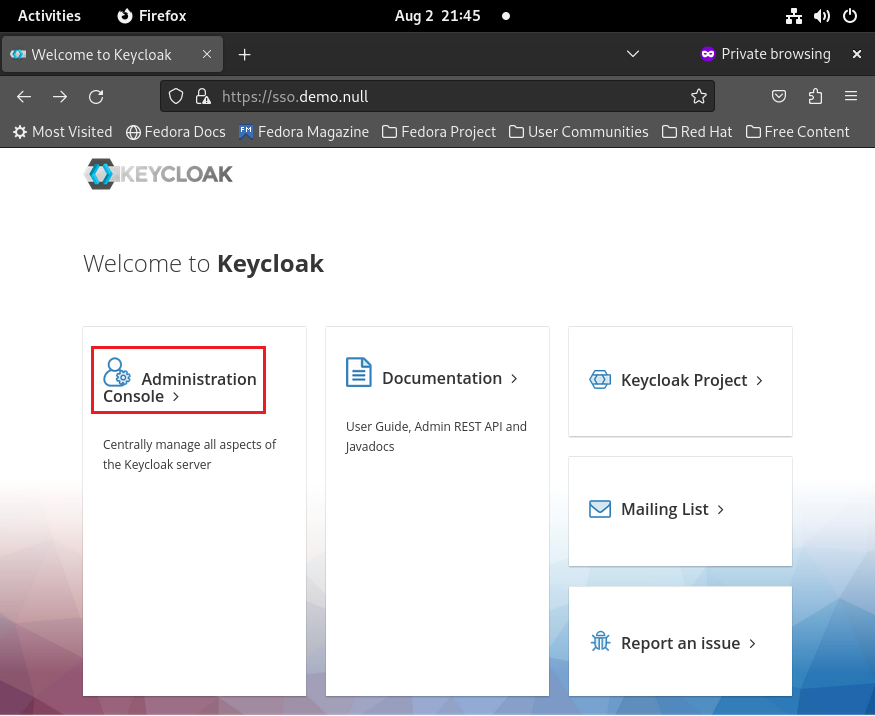

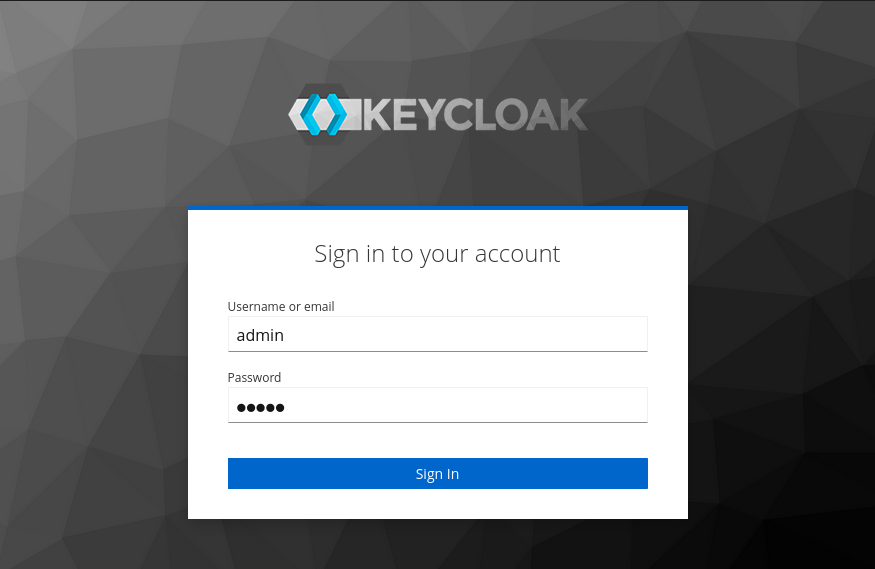

Then add a new realm for step-ca. You can name it anything you like, I'm using `step` here:

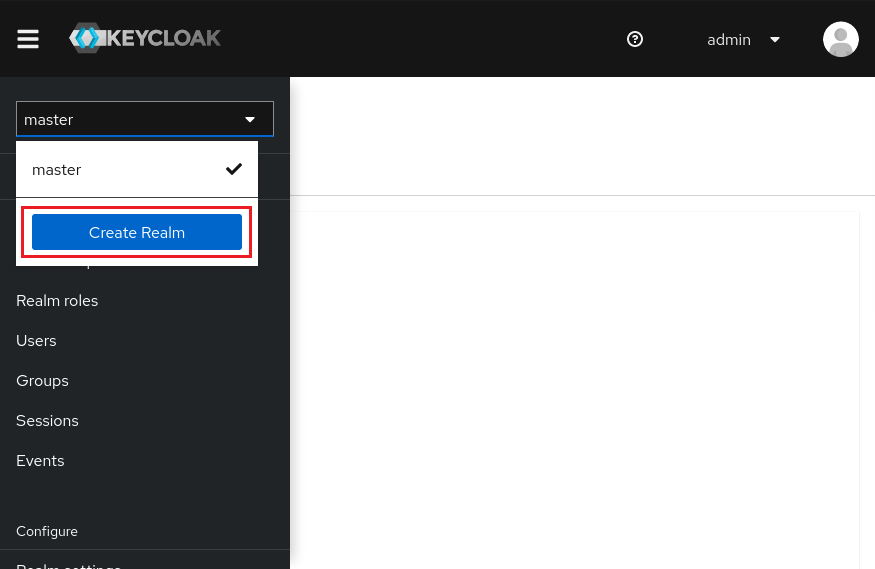

Then create a client for step-ca. I'm also using `step` as the client ID. Remember to turn on `Client authentication` and tick `OAuth 2.0 Device Authorization Grant` for browserless environment.

For the `Root URL` and `Home URL`, set both to `http://127.0.0.1:10000`

For the `Valid redirect URIs`, set to `http://127.0.0.1:10000/*`

Use `*` (a single star) for `Web origins`

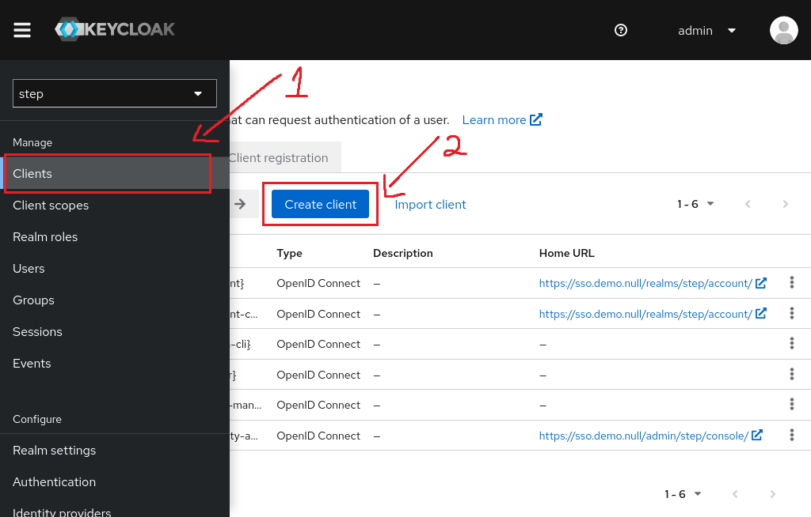

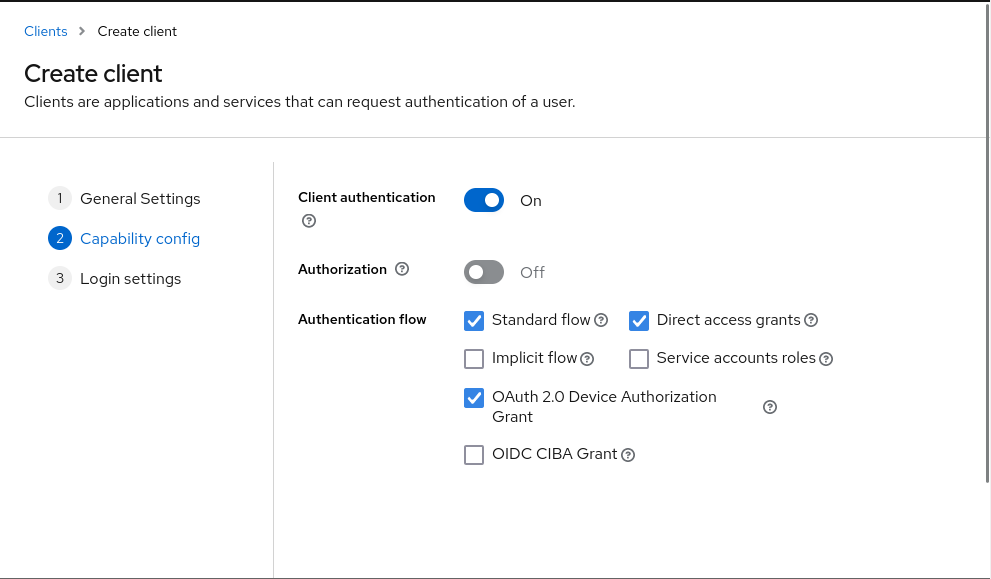

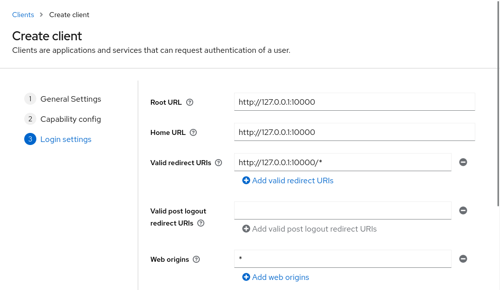

Click `Save`. Now go to the `Credentials` tab and take note of your `Client secret`. We'll need this later when configuring step-ca.

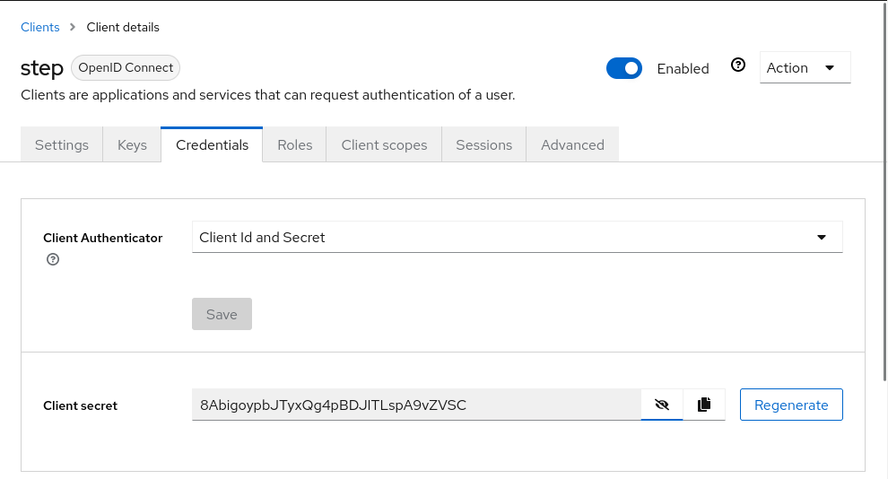

Now go to `Client scopes`. Since Keycloak version 19, it no longer includes client ID in the `aud` claims returned in the access token. More information [in this issue](https://github.com/keycloak/keycloak/issues/12415) and [this forum thread](https://keycloak.discourse.group/t/aud-field-in-access-token-in-keycloak-19/16757).

So, we need to manually add a static mapper for the `aud` claims. Select `<client id>-dedicated` in the `Assigned client scope` column, then click `Configure a new mapper`. Then choose `Audience` in the popup:

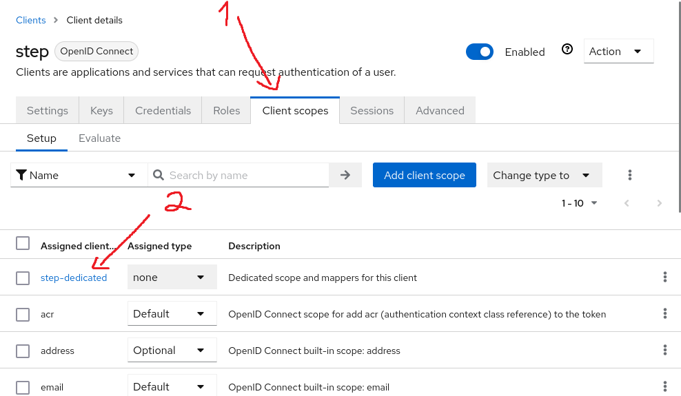

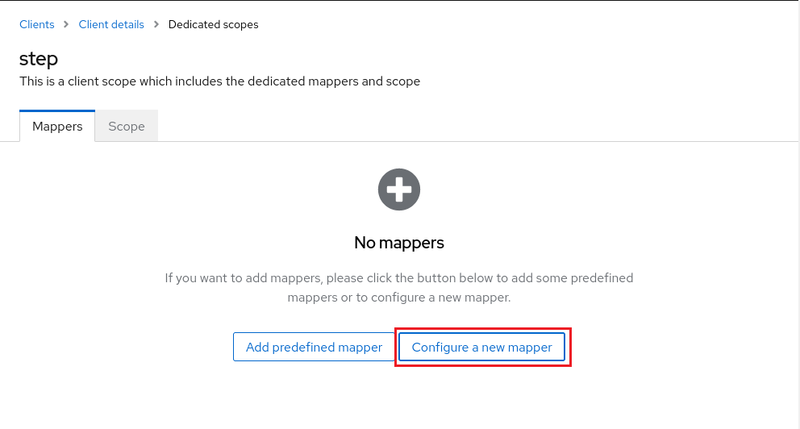

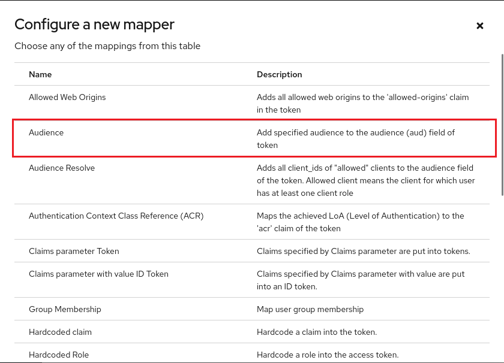

You can choose any name here. Make sure your client ID is selected in `Included Client Audience`. Also make sure `Add to access token` is turned on. 

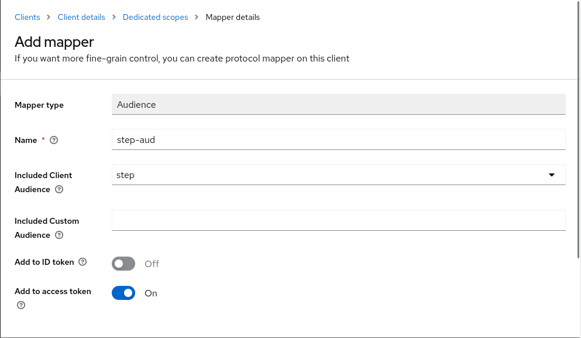

Click `Save`. 

Now get the OpenID endpoint configuration. Select `Realm settings` in the sidebar, then scroll down to `OpenID Endpoint Configuration`. Save that link for later.

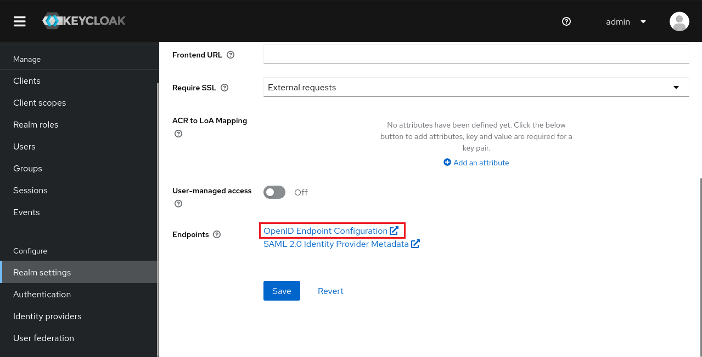

You might also want to enable registration in Keycloak. In the same sidebar, choose `Login` tab and turn on `User registration`.

You're done configuring Keycloak!

## Step-ca configuration

First, we need to exec into the `cli` container. Run
```bash
$ docker compose exec -it cli bash
```

You should be dropped into a shell. Now we can bootstrap `step` from the shell. We need fingerprint to do so, and also username and password of the first provisioner that `step-ca` created for us.

In another terminal, check the logs of `ca` container:
```bash
$ docker compose logs ca | head -50 
...
step-ca-keycloak-ca-1  | ✔️ Root fingerprint: eab28e7d2654f6d076f670bfef5f03c53f58b57d3e95a08db9b33f83c09c23dd
...
step-ca-keycloak-ca-1  | 👉 Your CA administrative username is: step
step-ca-keycloak-ca-1  | 👉 Your CA administrative password is: 1Ta9T872EtcL0RWmiFHWZOp9EK16B8BHR1wttkKe
...
```

Then bootstrap `step` in the `cli` container:
```bash
$ step ca bootstrap --ca-url https://ca.demo.null:9000 --fingerprint eab28e7d2654f6d076f670bfef5f03c53f58b57d3e95a08db9b33f83c09c23dd
The root certificate has been saved in /home/step/certs/root_ca.crt.
The authority configuration has been saved in /home/step/config/defaults.json.
```

Now add OIDC provisioner to step-ca. Use the client ID, client secret and configuration endpoint from Keycloak as setup above. It should ask for the admin credentials. Choose `JWK provisioner` and enter the username and password from step-ca.
```
$ step ca provisioner add keycloak --type oidc --client-id step --client-secret 8AbigoypbJTyxQg4pBDJITLspA9vZVSC --listen-address ":10000" --domain "demo.null" --configuration-endpoint https://sso.demo.null/realms/step/.well-known/openid-configuration
No admin credentials found. You must login to execute admin commands.
✔️️ Please enter admin name/subject (e.g., name@example.com): step
✔ Provisioner: admin (JWK) [kid: n7akOqqK_4QCsa54yTMMxP5DgK2WGWnCeir1JsPZQqg]
Please enter the password to decrypt the provisioner key:
```

You should be able to get certificates after signing in through Keycloak now!

## Test drive

We need a valid user at Keycloak to test our setup. Visit `https://sso.demo.null/realms/step/account/#/`, select `Sign in`, choose `Register` and register a new account

> :warning: Note: User email should be @demo.null, as we configure the OIDC provisioner to only generate certificates for that domain.

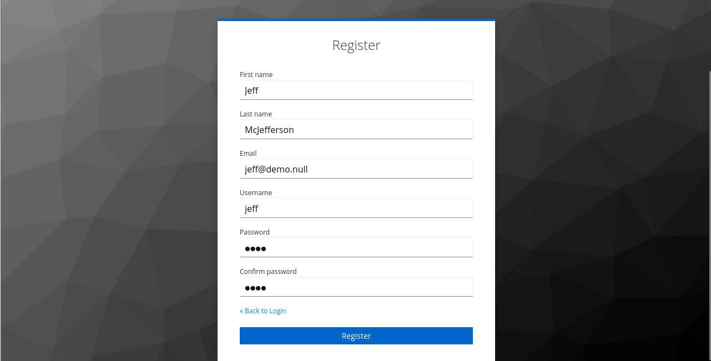

Now switch back to the terminal in `cli` container. Let's try generating a TLS certificate for our new user.
```
$ step ca certificate somewhere.demo.null cert.pem key.pem --provisioner keycloak --console
✔ Provisioner: keycloak (OIDC) [client: step]
Visit https://sso.demo.null/realms/step/device and enter the code: (press 'ENTER' to open default browser)
QTEJ-OKPQ
✔ CA: https://ca.demo.null:9000
✔ Certificate: cert.pem
✔ Private Key: key.pem
```

The `--console` is for headless OIDC authentication. It should print out an URL and a code for you to enter. Visit that URL and enter your code, after logging in with the new user created above. After that, you should have your certificates in your current directory.

<video controls>
  <source src="files/certificate-oidc-flow.mp4" type="video/mp4" />
</video>

Congratulations! You're now able to get TLS certificates without pinging your trusty sysadmin!

## Generating SSH certificates

Configuring SSH server to accept SSH certificates is a little more involved. First, we need to get `SSH User CA Key` from step-ca (it should be in the logs):
```bash
$ docker compose logs ca | head -60 | grep -i "SSH User CA Key"
step-ca-keycloak-ca-1  | 2023/08/03 12:12:02 SSH User CA Key: ecdsa-sha2-nistp256 AAAAE2VjZHNhLXNoYTItbmlzdHAyNTYAAAAIbmlzdHAyNTYAAABBBIfKRq8fQk7JZ0lbI1mE07+bbL2rDdMTah2c/gqNRaRCuyZz//FJ+4LSXVA7sFPnaETNNocNHILIX15MXpePnUU=
```

Now copy everything after the colon (`ecdsa ...`) and put it in a file named `step_ca_user_pub` in the `ssh/ssh_host_keys` folder.
```bash
$ echo "ecdsa-sha2-nistp256 AAAAE2VjZHNhLXNoYTItbmlzdHAyNTYAAAAIbmlzdHAyNTYAAABBBIfKRq8fQk7JZ0lbI1mE07+bbL2rDdMTah2c/gqNRaRCuyZz//FJ+4LSXVA7sFPnaETNNocNHILIX15MXpePnUU=" > ssh/ssh_host_keys/step_ca_user_pub
```

Edit `ssh/ssh_host_keys/sshd_config` and added `TrustedUserCAKeys /config/ssh_host_keys/step_ca_user_pub` to the bottom. Then restart the `ssh` service.
```
$ emacs ssh/sshd_config
# Do your editing
...
$ docker compose restart ssh
```

Then in your `cli` container, get an SSH certificate for user `jeff` on your `ssh` container. Since `step ssh` doesn't have `--console` flag, we have to do some manual work here:
```bash
$ eval $(ssh-agent -s)
Agent pid 306
$ TOKEN=$(step oauth --bare --client-id step --client-secret 8AbigoypbJTyxQg4pBDJITLspA9vZVSC --console --provider https://sso.demo.null/realms/step/.well-known/openid-configuration)
Visit https://sso.demo.null/realms/step/device and enter the code: (press 'ENTER' to open default browser)
KRJR-FAOQ
$ step ssh certificate jeff@demo.null id_ecdsa --provisioner keycloak --token "$TOKEN"
✔️ CA: https://ca.demo.null:9000
Please enter the password to encrypt the private key:
✔ Private Key: id_ecdsa
✔ Public Key: id_ecdsa.pub
✔ Certificate: id_ecdsa-cert.pub
✔ SSH Agent: yes
```
You can try inspecting your certificate for more details
```bash
id_ecdsa-cert.pub:
        Type: ecdsa-sha2-nistp256-cert-v01@openssh.com user certificate
        Public key: ECDSA-CERT SHA256:dgcL/RKvKBVOSq3TOdDGW/W+qBANFN59lLy1gKMeT7s
        Signing CA: ECDSA SHA256:840gjzSX5pxk/ECH34KPis6r9DFgdlea35y9pr5tP1c (using ecdsa-sha2-nistp256)
        Key ID: "jeff@demo.null"
        Serial: 12584123703664707947
        Valid: from 2023-08-03T14:40:38 to 2023-08-04T06:41:38
        Principals:
                jeff
                jeff@demo.null
        Critical Options: (none)
        Extensions:
                permit-X11-forwarding
                permit-agent-forwarding
                permit-port-forwarding
                permit-pty
                permit-user-rc
        Signature:
                00:00:00:20:1a:bd:b7:ab:8f:2f:00:a4:0c:9f:5f:7b:
                9c:4f:4e:10:ef:9f:ca:ba:35:45:c4:91:5c:cb:2f:5a:
                d9:ff:e8:46:00:00:00:21:00:97:38:a5:5b:8c:1a:d9:
                29:1d:96:e4:38:e4:25:9c:d7:ee:69:53:fd:1c:52:38:
                94:79:f1:24:3d:9f:39:3f:63
```

Finally, try ssh into your `ssh` container:
```
$ ssh -p 2222 jeff@ssh
The authenticity of host '[ssh]:2222 ([172.18.0.4]:2222)' can't be established.
ED25519 key fingerprint is SHA256:/jzaJafnlI/B6OzqvsIjN8zE/bEwRB0N02OXdvcZCic.
This key is not known by any other names.
Are you sure you want to continue connecting (yes/no/[fingerprint])? yes
Warning: Permanently added '[ssh]:2222' (ED25519) to the list of known hosts.
Welcome to OpenSSH Server
$ whoami
jeff
```

Congratulations! You can now get yourself a shiny new SSH certificate for your SSH servers!

## More reading

You can find more information on:

1. [step-ca documentation](https://smallstep.com/docs/step-ca/)
2. [step-ca tutorials](https://smallstep.com/docs/tutorials/)

Also check out these videos:

{{ youtube(id="91SDvFRWhXw") }} 

{{ youtube(id="ZhxLRlcNUM4") }}

Let me know in the comments if you have any issues!

